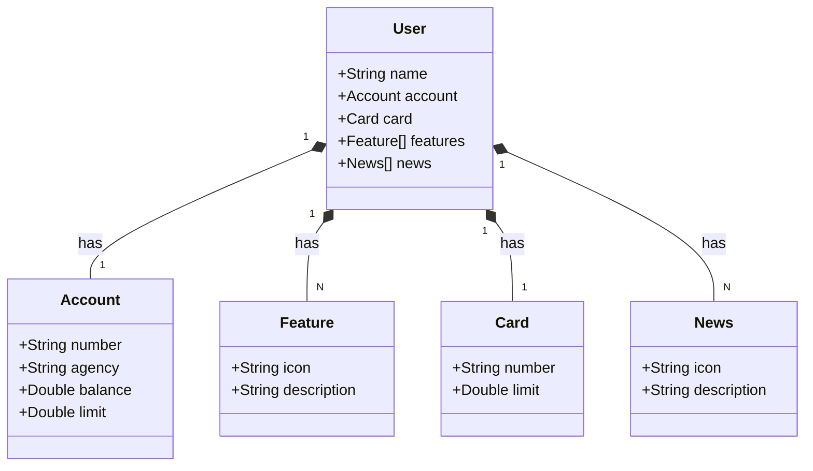

# Bootcamp Claro - Java com Springboot
Java RESTful API criada para o bootcamp.

## Diagrama de Classes

```mermaid
classDiagram
    class User {
        +String name
        +Account account
        +Card card
        +Feature[] features
        +News[] news
    }

    class Account {
        +String number
        +String agency
        +Double balance
        +Double limit
    }

    class Feature {
        +String icon
        +String description
    }

    class Card {
        +String number
        +Double limit
    }

    class News {
        +String icon
        +String description
    }

    User "1" *-- "1" Account : has
    User "1" *-- "N" Feature : has
    User "1" *-- "1" Card : has
    User "1" *-- "N" News : has
```
